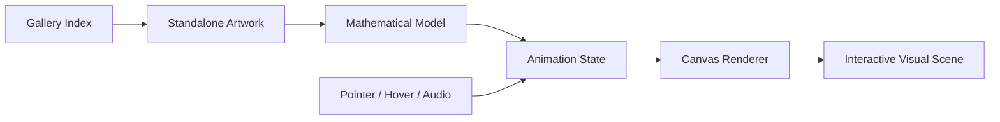

# Eidola

Browser-native generative art gallery built from dynamical systems, motion, geometry, and atmosphere.

<p align="center">
  
</p>

## Summary

Eidolon is a collection of standalone interactive HTML/canvas artworks. The pieces explore strange attractors, tensegrity, modal vibration, coupled oscillators, grain, glow, typography, and responsive motion. It is the creative-technology wing of the portfolio: a studio artifact that shows aesthetic direction, mathematical visual systems, and comfort building immersive browser-native experiences without a heavy framework.

## What It Demonstrates

- Creative coding with vanilla HTML, CSS, JavaScript, and Canvas.
- Real-time rendering loops with device-pixel-ratio handling and responsive layouts.
- Mathematical visual systems including strange attractors, modal shapes, tensegrity, and coupled oscillators.
- Interaction design through pointer response, hover states, motion, and optional audio.

## Architecture

Each artwork is a self-contained HTML file. The gallery entry point links to individual pieces, while each piece owns its own canvas setup, mathematical model, rendering loop, and interaction handling.



## Included Pieces

- `index.html` - gallery / eidola entry point
- `strange_attractor.html` - Aizawa-style attractor rendering
- `strange_attractor_halvorsen.html` - Halvorsen attractor variant
- `strange_attractor_rossler.html` - Rossler attractor variant
- `strange_attractor_thomas.html` - Thomas attractor variant
- `tensegrity.html` - tensegrity structure with modal vibration and audio
- `frozen_music.html` - circular modal field and sound interaction
- `the_third_light.html` - coupled oscillator / third-light visual system

## Usage

Open the gallery HTML in a browser:

```text
index.html
```

## Evidence

- Eight standalone interactive pieces.
- Canvas-based animation with custom rendering loops.
- Several pieces implement reduced-motion checks.
- Some pieces include Web Audio interaction.

## Known Limitations

- The gallery should be tested on mobile and desktop after publication.
- The project currently has no build step, automated tests, or asset pipeline by design.
- Audio behavior depends on browser autoplay/user-interaction policies.

## Status

Studio piece / creative technology artifact.
